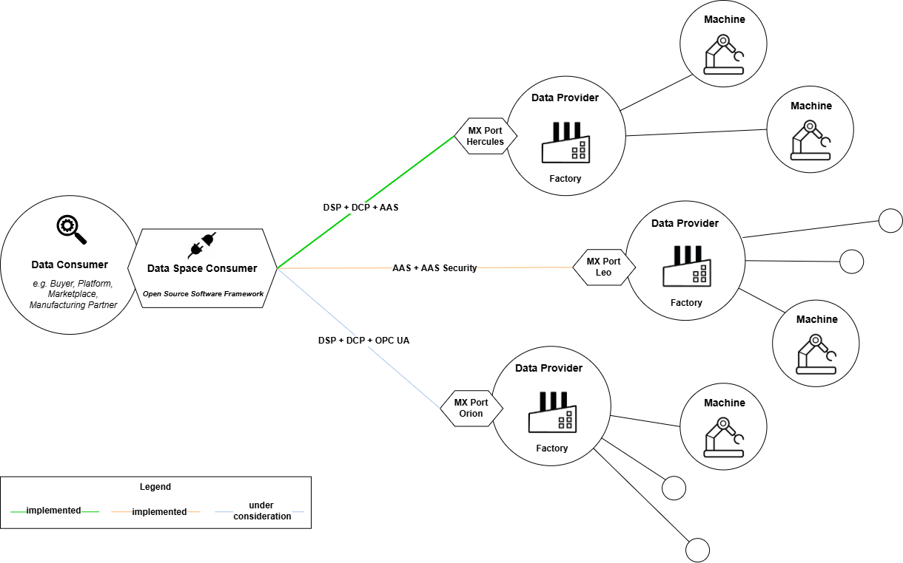
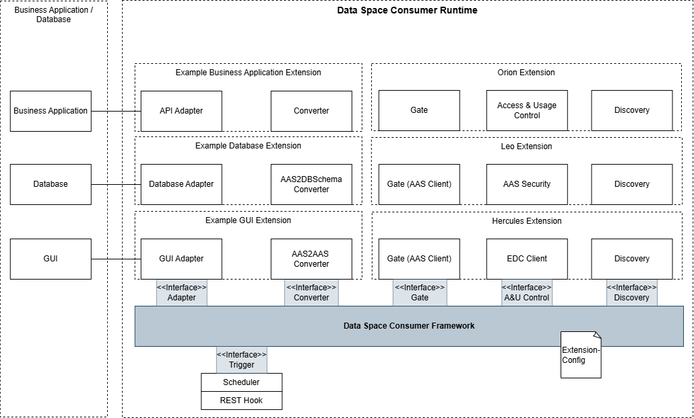
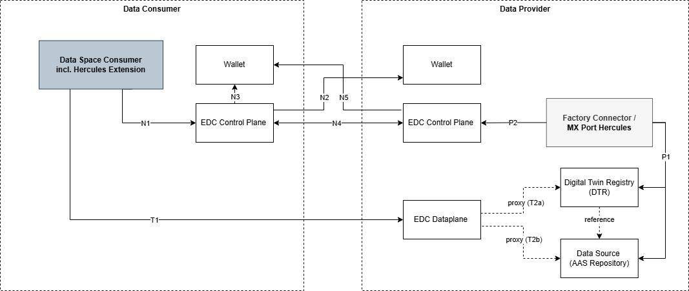

# Data Space Consumer

| Data Space Consumer is still under development. Contributions are highly welcome. |
| --------------------------------------------------------------------------------- |

The **Data Space Consumer** automates the retrieval of authorised data via [MX ports](https://factory-x.org/wp-content/uploads/MX-Port-Concept-V1.10.pdf) within data spaces.

The Data Space Consumer is being developed and tested as part of [**Factory-X**](https://factory-x.org/), a data space initiative for the digitalization of supply chains in industry with the aim of creating an open and collaborative digital ecosystem for factory equipment suppliers and operators. Factory-X is part of the [**Manufacturing-X**](https://www.plattform-i40.de/IP/Navigation/DE/Manufacturing-X/Initiative/initiative-manufacturing-x.html) initiative, which aims to enable companies to share their data confidently and collaboratively across the entire manufacturing and supply chain.

The **Data Space Consumer** offers a modular framework for retrieving authorised manufacturing and supply chain data.
This framework enables data consumers (e.g. buyers, platforms, partners) to automatically retrieve manufacturing and supply chain data shared by data providers such as manufacturers. The aim is to support the various MX port variants and thus enable secure and standardized data exchange.




## Data Space Consumer Architecture

The architecture of the “Data Space Consumer” is modular and allows different extensions to be configured for data requests and data output. The various extensions offer functions for the discovery, access and usage control, gate, converter and adapter layers out of the box with components like the [faaast-gate-extension](./extensions/faaast-gate-extension/).




| Components                                 | Goals                                                                                                                                 |
|--------------------------------------------|---------------------------------------------------------------------------------------------------------------------------------------|
| **Data Space Consumer Runtime**            | Data Space Consumer Runtime contains all components required for operation.                                                           |
| **Data Space Consumer Framework**            | Framework for interfaces and classes.                                                                                                 |
| **Adapter Interface**                      | Interface for generic adapter components.                                                                                             |
| **Converter Interface**                    | Interface for the generic converter components.                                                                                       |
| **Gate Interface**                         | Interface for generic gate components.                                                                                                |
| **A&U Control Interface**                  | Interface for the generic access and usage control components.                                                                        |
| **Discovery Interface**                    | Interface for the generic discovery components.                                                                                       |
| **Trigger Interface**                      | Interface for generic trigger components.                                                                                             |
| **Scheduler**                              | Scheduler for setting API request intervals.                                                                                          |
| **REST Hook**                              | REST hook that can be addressed as an alternative to the scheduler.                                                                   |
| **Extension-Config**                       | The individual MX port variants can be configured using a config file.                                                                |
| **Hercules Extension**                     | Hercules Extension for secure data exchange via Data Space Protocol (DSP), Decentralized Claims Protocol (DCP) and AAS.               |
| **Leo Extension**                          | Leo Extension for secure data exchange via AAS and AAS Security.                                                                      |
| **Orion Extension**                        | Orion Extension for secure data exchange via Data Space Protocol (DSP), Decentralized Claims Protocol (DCP) and OPC UA.               |
| **Example Business Application Extension** | Example Business Application Extension for data conversion into various target formats and connect to specific business applications. |
| **Example Database Extension**             | Example Database Extension for data conversion into various database formats and connect to specific databases.                       |
| **Example GUI Extension**                  | Example GUI Extension for data visualization.                                                                                         |


## Extensions
### Discovery
| Name                                                                     | Description                                                                                                                                                                     | Status | Can be used for  |
|--------------------------------------------------------------------------|---------------------------------------------------------------------------------------------------------------------------------------------------------------------------------|--------|------------------|
| [aas-dsp-discovery-extension](./extensions/aas-dsp-discovery-extension/) | conform to [ADR 002 – Cross-Company Authorization and Discovery](https://factory-x-contributions.github.io/architecture-decisions/docs/hercules/adr002-authorization-discovery) | ✅      | Hercules MX-Port |

### Access & Usage Control 
| Name                                                                                         | Description                                                                                                                                                                                                                                                                                                                                                    | Status | Can be used for  |
|----------------------------------------------------------------------------------------------|----------------------------------------------------------------------------------------------------------------------------------------------------------------------------------------------------------------------------------------------------------------------------------------------------------------------------------------------------------------|--------|------------------|
| [fx-edc-access-usage-control-extension](./extensions/fx-edc-access-usage-control-extension/) | Client which use the [Facotry-X EDC](https://github.com/factory-x-contributions/factoryx-edc) for access control, conform to [ADR 003](https://factory-x-contributions.github.io/architecture-decisions/docs/hercules/adr003-authentication) and [ADR 009](https://factory-x-contributions.github.io/architecture-decisions/docs/hercules/adr009-aas-rest-dsp) | ✅      | Hercules MX-Port |
| aas-security-client                                                                          | Client which use AAS security for access control                                                                                                                                                                                                                                                                                                               | ⏳      | Leo MX-Port      |

### Gate
| Name                                                         | Description                                                                                 | Status | Can be used for                  |
|--------------------------------------------------------------|---------------------------------------------------------------------------------------------|--------|----------------------------------|
| [faaast-gate-extension](./extensions/faaast-gate-extension/) | Use the [FAAAST Client](https://github.com/FraunhoferIOSB/FAAAST-Client) to access AAS data | ✅      | Hercules MX-Port and Leo MX-Port |

### Converter
| Name                                                                   | Description                                   | Status | Can be used for                  |
|------------------------------------------------------------------------|-----------------------------------------------|--------|----------------------------------|
| [simple-converter-extension](./extensions/simple-converter-extension/) | Can convert a list of AAS data to json format | ✅      | Hercules MX-Port and Leo MX-Port |

### Adapter
| Name                                                                 | Description                              | Status | Can be used for                  |
|----------------------------------------------------------------------|------------------------------------------|--------|----------------------------------|
| [console-adapter-extension](./extensions/console-adapter-extension/) | Console logging for an initial test      | ✅      | Hercules MX-Port and Leo MX-Port |
| [rest-adapter-extension](./extensions/rest-adapter-extension/)       | REST adapter extension for data transfer | ⏳      | Hercules MX-Port and Leo MX-Port |

---
### Hercules Extension
Data exchange via MX port Hercules for secure data exchange via [Data Space Protocol (DSP)](https://github.com/eclipse-dataspace-protocol-base/DataspaceProtocol) and [Decentralized Claims Protocol (DCP)](https://github.com/eclipse-dataspace-dcp/decentralized-claims-protocol) using the Asset Administration Shell (AAS) as the data model.
When using the MX port Hercules extension, the following [Factory-X Architecture Decision Records](https://factory-x-contributions.github.io/architecture-decisions/) are fulfilled.
- [ADR 002 – Cross-Company Authorization and Discovery](https://factory-x-contributions.github.io/architecture-decisions/docs/hercules/adr002-authorization-discovery)
- [ADR 003 – Authentication for Dataspace](https://factory-x-contributions.github.io/architecture-decisions/docs/hercules/adr003-authentication)
- [ADR 008 – Asset Administration Shell Profile for Factory-X](https://factory-x-contributions.github.io/architecture-decisions/docs/hercules/adr008-aas-profile)
- [ADR 009 – Discovery of AAS Services via DSP](https://factory-x-contributions.github.io/architecture-decisions/docs/hercules/adr009-aas-rest-dsp)

#### Data exchange steps via the MX port Hercules


The data exchange steps via MX port Hercules are based on: [Based on the Catena-X Connector KIT](https://eclipse-tractusx.github.io/docs-kits/kits/connector-kit/adoption-view/#interaction-overview)

The figure shows the interaction between a data consumer and a data provider. The first action is done by the provider, by preparing the necessary resources to offer data to potential consumers:
- P1: **Provide** the **data** according to the offered contract definitions and in the transfer type technology used, e.g., operate a resource server like a **Digital Twin Registry** and a **AAS Repository**.
- P2: **Create** the **data assets** and **policies**. Build **contract definitions** by combining created assets with a **usage** and an **access policy**.

With these steps, data is available and offered in a way that it can be found by consumers and access can be negotiated.

The negotiation is initiated on the consumer side. Before engaging in a contract negotiation, the consumer must be issued an [identifiers (**DID**)](https://w3c-ccg.github.io/did-method-web/) by an identity provider (e.g., issuer service).

Based on the consumers identity, the contract can be negotiated.
- N1: The Data Space Consumer (with the Hercules Extension) initiates a **request** as defined in the **dataspace protocol (DSP)** to be executed by the **control plane** of the consumer connector.
- N2: The control plane **resolves** the **provider's DID** to access the corresponding DID document.
- N3: Before initiating a **DSP request**, the consumer control plane must acquire an **access token** that allows the control plane of the provider to verify the identity of the consumer. This token is provided by the **consumer's wallet**.
- N4: The **consumer control plane** finally executes the intended **DSP request** by calling the corresponding **DSP endpoint** at the provider control plane, attaching the access token from step N3.
- N5: The **provider control plane** retrieves the verifiable credentials necessary to **validate the legitimacy** of the request by calling the consumer's wallet using the token created in step N3. The provider accesses the relevant consumer credentials (e.g., a membership credential) and **checks their validity**. In addition, the provider checks whether all other conditions like further policy constraints are met and if successful, accepts the contract offer and sends an agreement to the consumer control plane.

The final step is the actual **data transfer**, after the transfer process has started. The figure shows the standard HTTP pull mechanism, where the Data Space Consumer receives an access token from the provider which is then used to access the provided resource. In the current setup, the **access is controlled by the data plane of the provider**, i.e., the **data plane acts as a proxy** that receives the request (**step T1**) and forwards it to the actual data source (**step T2a** to the DTR or **step T2b** to the AAS repository).

### Leo Extension
Leo extension is in planning. Contributions are highly welcome.

### Orion Extension
Orion extension is under consideration. Contributions are highly welcome.

## Getting started

### Configuration
**1. Layer Implementations**

Each layer requires:
- **JAR File**: Place the custom implementation JAR in the deployment-specific `extensions` folder
- **Implementation Class**: Specify the fully qualified class name (classpath)
- **Config**: Layer-specific configuration (format and parameters vary per implementation)

**2. Configure the implementation [application.yaml](./mx-port-consumer-framework/src/main/resources/application.yaml)**

```yaml
mx-port:
  - name: MX-PortName                                   # Unique identifier for this port
    discovery:
      implementation: com.your.package.DiscoveryImpl    # Full classpath
      config: { }                                       # Implementation-specific config
    accessAndUsageControl:
      implementation: com.your.package.AccessImpl
      config: { }
    gate:
      implementation: com.your.package.GateImpl
      config: { }
    converter:
      implementation: com.your.package.ConverterImpl
      config: { }
    adapter:
      implementation: com.your.package.AdapterImpl
      config: { }
```

**3. Configure the trigger in [application.yaml](./mx-port-consumer-framework/src/main/resources/application.yaml)**

Choose **one** trigger type:

Option A: REST Hook
```yaml
    trigger:
      restHook:
        enabled: true
```
→ Trigger via REST to /trigger with request body mxPortName: 
```bash
curl --request POST \
  --url http://localhost:8080/trigger \
  --header 'content-type: application/json' \
  --data '{
  "mxPortName": {mxPortName}
}'
```

Option B: Scheduler
```yaml
    trigger:
      scheduler:
        enabled: true
        cron: "0 0/5 * * * ?"    # Runs every 5 minutes
```
→ Automatically triggers on cron schedule

### Docker Deployment

For detailed instructions on how to deploy the Data Space Consumer using Docker, see the [docker deployment](./deployment/docker).

### Helm Chart Deployment

For detailed instructions on how to deploy the Data Space Consumer using the Helm chart, see the [helm deployment](./deployment/helm).

## Development

For detailed instructions on how to set up the development environment and contribute to the Data Space Consumer, see the [development README](./docs/development/README.md).

## How to write your own extension

For detailed instructions on how to create a custom plugin for the Data Space Consumer Framework, see the [custom-extension README](./docs/custom-extension/README.md).


## Contributing

Contributions are what make the open source community such an amazing place to learn, inspire, and create. Any contributions are **greatly appreciated**.

## License

Distributed under the Apache 2.0 License. See `LICENSE` for more information.

Copyright (C) 2026 Fraunhofer Institut IOSB, Fraunhoferstr. 1, D 76131 Karlsruhe, Germany.

You should have received a copy of the Apache 2.0 License along with this program. If not, see https://www.apache.org/licenses/LICENSE-2.0.html.
